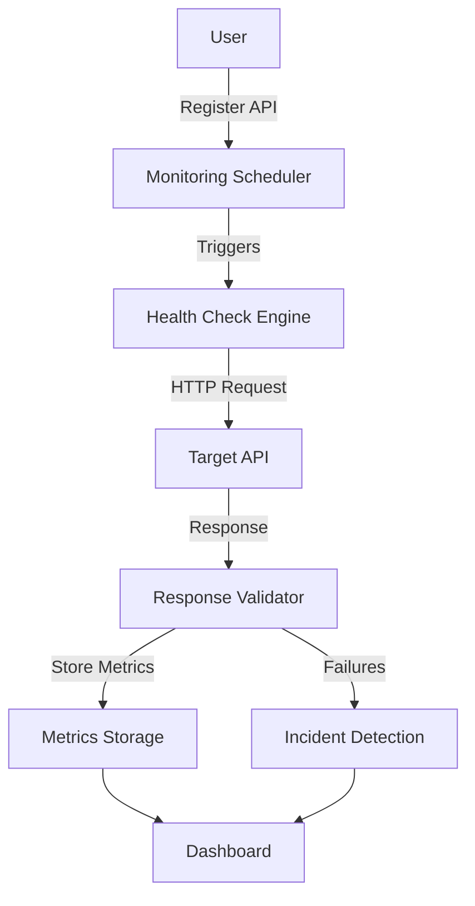

# API Observability Platform

A full-stack API monitoring platform that continuously monitors REST APIs through scheduled health checks, validates responses, tracks uptime and latency, detects outages, manages incidents, visualizes historical performance metrics, and generates operational reports.

## Tech Stack

### Frontend
- **React** + **TypeScript** — UI framework
- **Ant Design** — Component library (dark theme)
- **Recharts** — Data visualization (charts, graphs)
- **React Query** — Server state management
- **React Router** — Client-side routing
- **Axios** — HTTP client

### Backend
- **Node.js** + **Express.js** — API server
- **Mongoose** — MongoDB ODM
- **node-cron** — Scheduled monitoring jobs
- **JWT** (jsonwebtoken + bcryptjs) — Authentication
- **Axios** — Health check HTTP client
- **PDFKit** — PDF report generation

### Database
- **MongoDB** (local instance)

## System Architecture




## Features

### Core Features
1. **API Registration** — Register API endpoints with customizable monitoring config
2. **Scheduled Monitoring** — Automatic health checks at 1m/5m/15m/1h intervals via node-cron
3. **Health Check Engine** — Captures status code, response time, response body, headers
4. **Response Validation** — Validates expected HTTP status, JSON fields, content type
5. **Incident Management** — Auto-creates incidents after 3 consecutive failures, auto-resolves on recovery
6. **Dashboard** — KPI cards, response time trends, status distribution, uptime charts
7. **API Details** — Per-API metrics, monitoring history, response viewer
8. **Historical Metrics** — Time-series data over 24h/7d/30d with aggregation pipelines
9. **Search & Filters** — Filter APIs by status (healthy/degraded/offline), search by name
10. **PDF Reports** — Downloadable reports with uptime, incidents, performance data

### Authentication
- JWT-based authentication
- Protected routes (frontend + backend)
- User-scoped data isolation

## Getting Started

### Prerequisites
- Node.js 18+
- MongoDB (local instance running on port 27017)

### Backend Setup

```bash
cd backend
npm install

# Copy and configure environment variables
cp .env.example .env

# Start the server (with auto-reload)
npm run dev
```

The backend runs on `http://localhost:5000`.

### Frontend Setup

```bash
cd frontend
npm install

# Start the dev server
npm run dev
```

The frontend runs on `http://localhost:5173`.

### Environment Variables

Create a `.env` file in the `backend/` directory:

```env
MONGODB_URI=mongodb://localhost:27017/api_observability
JWT_SECRET=your-secret-key
JWT_EXPIRES_IN=7d
PORT=5000
NODE_ENV=development
```

## Project Structure

```
api-observability-platform/
├── backend/
│   └── src/
│       ├── api/            # Express route handlers
│       ├── database/       # MongoDB connection
│       ├── models/         # Mongoose schemas
│       ├── services/       # Business logic
│       ├── utils/          # Auth & error handling
│       └── server.js       # Entry point
├── frontend/
│   └── src/
│       ├── components/     # Reusable UI components
│       ├── hooks/          # React hooks (auth context)
│       ├── layouts/        # App layout with sidebar
│       ├── pages/          # Route pages
│       ├── services/       # API service modules
│       └── types/          # TypeScript definitions
└── README.md
```

## API Endpoints

### Authentication
| Method | Endpoint | Description |
|--------|----------|-------------|
| POST | `/api/auth/register` | Register a new user |
| POST | `/api/auth/login` | Login and get JWT token |
| GET | `/api/auth/me` | Get current user profile |
| PUT | `/api/auth/password` | Change password |

### API Monitors
| Method | Endpoint | Description |
|--------|----------|-------------|
| POST | `/api/apis` | Create a new API monitor |
| GET | `/api/apis` | List all APIs (search/filter) |
| GET | `/api/apis/:id` | Get API details |
| PUT | `/api/apis/:id` | Update API monitor |
| DELETE | `/api/apis/:id` | Delete API + related data |
| POST | `/api/apis/:id/check` | Trigger manual health check |

### Monitoring
| Method | Endpoint | Description |
|--------|----------|-------------|
| GET | `/api/monitoring/dashboard` | Dashboard KPIs |
| GET | `/api/monitoring/dashboard/charts` | Dashboard chart data |
| GET | `/api/monitoring/:id/results` | Paginated monitoring results |
| GET | `/api/monitoring/:id/metrics` | API metrics (uptime, latency) |
| GET | `/api/monitoring/:id/trend` | Response time trend |

### Incidents
| Method | Endpoint | Description |
|--------|----------|-------------|
| GET | `/api/incidents` | List incidents (filterable) |
| GET | `/api/incidents/:id` | Get incident details |
| PUT | `/api/incidents/:id` | Update incident status |
| DELETE | `/api/incidents/:id` | Delete incident |

### Reports
| Method | Endpoint | Description |
|--------|----------|-------------|
| GET | `/api/reports/generate` | Generate & download PDF report |
